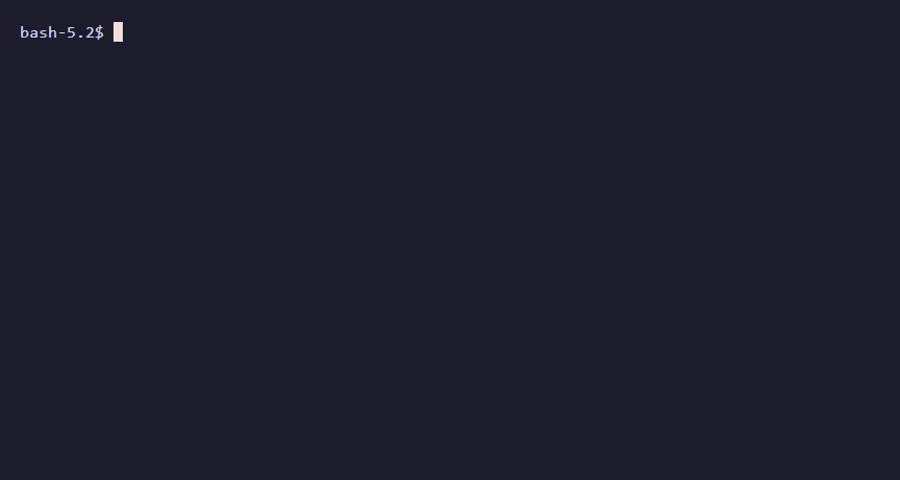

# Rusty Game Boy Emulator

A work-in-progress Nintendo **Game Boy (DMG-01)** emulator written in Rust.

This project currently has a solid **CPU + memory bus + timer + interrupts** core, passing Blargg's CPU instruction tests, and is now focused on developing the PPU rendering pipeline and cartridge support.

## Current Status

### Implemented / Working
- **CPU core**
  - 8-bit registers, `PC`, `SP`, flags, stack operations
  - The base instruction set has been implemented
  - **CB-prefixed instruction set** implemented (rotates/shifts/bit ops/`SWAP`, including `(HL)` variants)
  - Control flow: `JP`, `JR`, `CALL`, `RET`, `RETI`, `RST`, `HALT`, `DI`/`EI` (with EI-delay handling)
  - Passing the Blargg `cpu_instrs` test ROMs
- **Memory bus**
  - Address-decoding scaffolding and basic read/write
  - Internal RAM handling
  - VRAM access support at the bus level
- **Timer**
  - Timer ticking integrated into the main execution loop (ticks per T-cycle)
  - Timer interrupt request on overflow
  - TIMA reload-write and DIV/TAC multiplexer-glitch edge cases handled (matches Mooneye's timer tests)
- **Interrupt system**
  - Interrupt enable/flag management and interrupt handling in the CPU step
- **PPU/GPU (partial)**
  - VRAM storage, tile decoding, LCD register storage
  - Scanline counting (`LY`) with STAT coincidence flag (`LY`==`LYC`) and LCD enable/disable behaviour
  - Basic `minifb` display window scaffold behind a `--display` flag (not yet wired to real PPU/CPU framebuffer output)

### Partially Implemented
- **PPU/GPU rendering**, still missing:
  - No OAM Search / Pixel Transfer / HBlank state machine, only a flat mode-by-dot-clock counter
  - No framebuffer composition
  - No window/background/sprite rendering pipeline
  - Display window is a static test pattern, not driven by PPU state yet

### Not Implemented Yet
- **Cartridge / MBC**
  - ROM loading exists for local test ROM execution, but full MBC support is not complete
- **Real-time rendering loop**
  - `minifb` window opens, but framebuffer output isn't hooked up to the PPU yet
- **Joypad input**
- **Save states**
- **APU/audio** (Low Priority)
- **Boot ROM behaviour / full hardware accuracy** 

## Running

### Prerequisites
- Rust toolchain (stable) installed via `rustup`

### Run the current tests (Blargg CPU instruction tests)
The default `main` runs a Blargg CPU test ROM headless and prints serial output emitted by the ROM.

1. Ensure test ROMs exist at the expected path:
   - `blargg/cpu_instrs/individual/11-op a,(hl).gb` (the default, set in `DEFAULT_TEST_ROM` in `src/main.rs`)

2. Run:
   - `cargo run` (default ROM), or
   - `cargo run -- <rom-path>` for a specific `.gb` file

The headless loop:
- steps the CPU,
- ticks the timer and PPU **per T-cycle**,
- prints **serial output** as soon as it appears (used by test ROMs to report PASS/FAIL), and
- writes a Game Boy Doctor-format trace log to `doctor_<rom_stem>.log`.

### Run the display window (scaffold only)
- `cargo run -- --display` opens a `minifb` window at GB resolution (160x144, scaled 4x) showing a static test pattern. It is not yet wired to real PPU/CPU framebuffer output.

### Blargg `cpu_instrs` results

Each ROM below reports `Passed`/`Failed` over the Game Boy serial port; the runner now exits as soon as that result is seen instead of spinning to the cycle cap. GIFs recorded with [VHS](https://github.com/charmbracelet/vhs) via `docs/vhs/generate-cpu-gifs.sh`.

| # | Test | Result |
|---|------|--------|
| 01 | `special` |  |
| 02 | `interrupts` |  |
| 03 | `op sp,hl` |  |
| 04 | `op r,imm` |  |
| 05 | `op rp` |  |
| 06 | `ld r,r` |  |
| 07 | `jr,jp,call,ret,rst` |  |
| 08 | `misc instrs` |  |
| 09 | `op r,r` |  |
| 10 | `bit ops` |  |
| 11 | `op a,(hl)` |  |

## Project Layout (high level)

- `src/main.rs` - entry point: headless test-ROM runner (CPU stepping + timer/PPU ticking + serial output) or `--display` window mode
- `src/cpu/` - CPU struct and instruction execution, split by concern (`execute.rs`, `control_flow.rs`, `stack_interrupts.rs`, `load.rs`, `arithmetic.rs`, `prefix.rs`, `fetch_trace.rs`) — see `docs/cpu_modules.md`
- `src/instructions/` - the `Instruction` enum and operand-target types
- `src/instructions/decode/` - decoding raw opcode bytes into `Instruction` values, split by instruction family
- `src/memory_bus.rs` - bus and address mapping
- `src/timer.rs` - DIV/TIMA/TMA/TAC timer logic
- `src/interrupts.rs` - interrupt controller
- `src/ppu.rs` - GPU/PPU: VRAM, tile decoding, LCD registers, STAT coincidence flag (no scanline state machine/rendering yet)
- `src/display.rs` - `minifb` window scaffold (static test pattern, not wired to the PPU)
- `src/cartridge_header.rs` - Game Boy cartridge header parsing for logging/info
- `src/register.rs` - 8/16-bit register model and flag register

## Roadmap

### Graphics (PPU)
- Implement PPU timing/state machine (OAM Search / Pixel Transfer / HBlank / VBlank)
- LCD interrupt sources (STAT interrupt selects, LYC=LY interrupt)
- Produce a framebuffer and connect it to the `minifb` display window

### Longer-term
- Implement proper **MBC and cartridge support** (MBC3 is the priority)
- DMA behavior and timing
- Joypad input mapping
- Audio (APU)
- Save states
- Real-time pacing to actual Game Boy clock speed (currently runs unthrottled)
- Game Boy Color (CGB) support (after DMG baseline is solid)

## Notes
- This is not yet a playable emulator. It's currently a CPU/timer/PPU-register core with a test ROM runner and a disconnected display scaffold.
- The CPU timing is not currently real world and will run at unlimited speed.
- Expect behaviour differences vs hardware in unimplemented areas (PPU rendering/APU/MBC/DMA).

## References

### Documentation
- Pan Docs: https://gbdev.io/pandocs/
- Opcode table: https://meganesu.github.io/generate-gb-opcodes/
- Game Boy: Complete Technical Reference (PDF): https://gekkio.fi/files/gb-docs/gbctr.pdf
- RGBDS :https://rgbds.gbdev.io/docs/v1.0.1/gbz80.7
- Gameboy development community: https://gbdev.io/
- Realboy emulator blog: https://realboyemulator.wordpress.com/
- ASMSchool lessons: http://gameboy.mongenel.com/asmschool.html

### Test ROMs
- Blargg GB test ROMs: https://github.com/retrio/gb-test-roms
- Mooneye test suite: https://github.com/Gekkio/mooneye-test-suite
